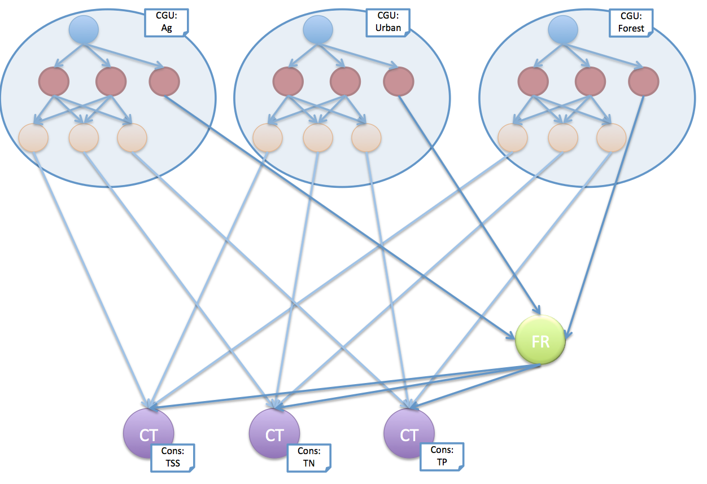

# Model Dimensions

Openwater model graphs can easily reach to tens of thousands of model nodes. Any particular component model, such as a particular rainfall runoff model, will likely be used for many individual model nodes, representing a different aspect of the model in each case, such as representing a particular landuse within a particular subcatchment.

Managing such a model graph requires a means to identify what a particular model node represents. This is necessary for several key tasks, including:

* Assigning model parameters and input timeseries,
* Making connections between nodes,
* Retrieving and interpreting models results, and
* Querying the model setup

Openwater supports the addition of user defined metadata tags to model nodes, to support this identification process. Each node can be labelled with multiple tags, each of which has a 'type' (such as `subcatchment`) and a value (such as `subactchment 42`). Typically, a model graph will employ a small number of tag types, and a signifcantly larger number of tag values for any particular tag type.

The set of tag values, for a particular tag type, are considered to be the 'dimension' of that tag type. So, for the `subcatchment` tag type, the set of all catchment labels would form the subcatchment dimension for the model graph.

## Minimum attribute requirements

The choice of attributes is context dependent. For example, a catchment model might use attributes to distinguish different subcatchments, different landuse and different water quality constituents.

At a minimum, each model node using a particular component model, must be distinguished from other such model nodes by a unique combination of attributes.

So, in the rainfall runoff and constituent generation example, the scaling model nodes (red) would require attributes, as would the constituent generation model nodes (orange):

The constituent generation nodes are tagged for the constituent represented, with the `Cons` tag type and attribute values `TSS`, `TP` and `TN`. The scaling nodes are tagged with the different runoff components output by the rainfall runoff model, using the `Comp` tag type and the `Quick`, `Slow` and `Total` values.

The rainfall runoff model node (blue) doesn't require any attributes, at there is only one rainfall runoff model node in the graph. If however, this graph is used as a template to create multiple copies of the graph, there will be additional attributing requirements.

## Attributes and Templates

Attributes are necessary to uniquely identify model nodes, when a particular component model is used for more than one model node. In the above example, the rainfall single runoff model node didn't require any attributes.

However, when the graph becomes a template and is used to create multiple 'Constituent Generation Units', we need to introduce more attributes:

Here, each copy of the graph template is assigned a `CGU` tag, identifying the different area (here, a land use) being modelled, and the constituent transport model nodes require tags for the different constituents.

The constituent transport model nodes use the same tag type, `Cons`, as was used for the constituent generation models. This overlap is possible because different component models are used. Indeed this consistency is highly recommened for simplifying model management, such as creating links.

While the above figure shows the `CGU` tag being applied to the graph template, in reality, the tags are assigned to _every_ model node within the template:

Now, the rainfall runoff model nodes are tagged with the `CGU` tag type, while the other nodes in the template have the `CGU` tag type added to their existing tags.

This approach continues as model graphs are built up from templates. So, for example, as catchments are created and tagged with a `SC` tag type:

the `SC` tag propagates to the subcatchment template:

and, finally, to the CGU template:

## Identifying nodes with tags

With the propagation of tags from templates down to individual nodes, each node in the model graph can be identified by its unique combination of tag values.

So, for example, it is possible to extract the timeseries of constituent load from the constituent generation model node for constituent (`Cons`) `TSS`, in the `Ag` `CGU` in subcatchment (`SC`) 1.

It is also possible, and often useful, to be able to identify a group of model nodes by specifying only a subset of tags. So, for example, specifying `CGU=Ag` and `Cons=TP` would match the corresponding constituent generation model nodes in all three subcatchments. This type of broad node matching is used heavily in the [parameterisation of models](parameterisation.md) and when [retrieving results](reporting.md).

