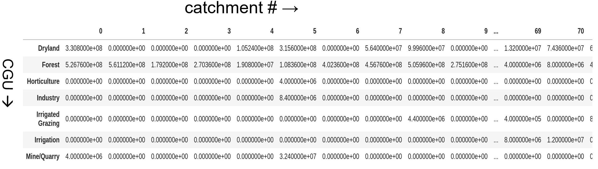
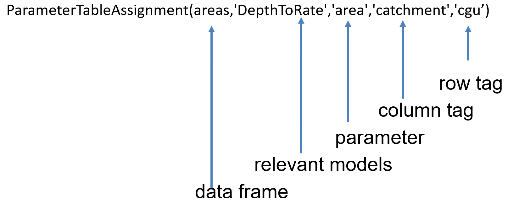
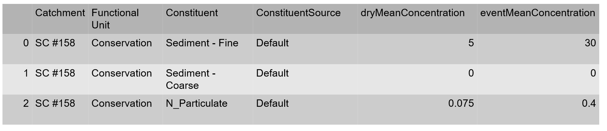
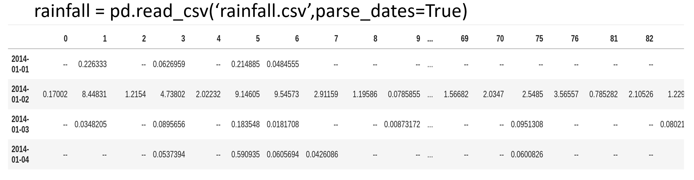
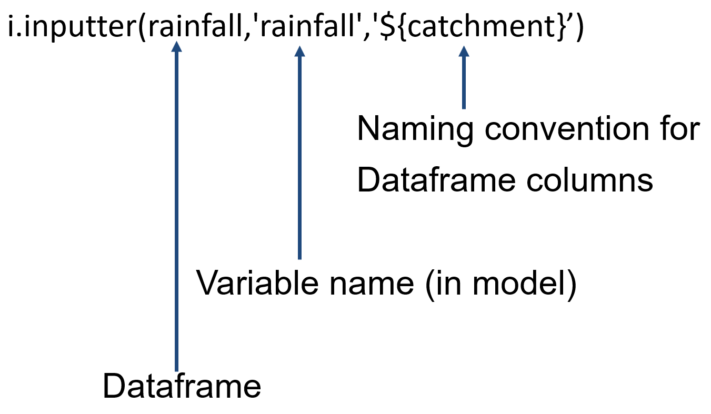

# Model parameterisation

Each individual node, within an Openwater model graph, can be configured independently, and generic tools are available to apply data sets, to nodes, using the [tags](dimensions.md) applied to the nodes.

## Values to configure

There are three key types of values required by model nodes:

1. Model parameters, which are often, but not necessariy scalars or tables of values,
2. Initial state values, which are also scalars or tables, and
3. Timeseries inputs, which are provided as arrays with one value per model timestep

Each component model type defines its own set of parameters, initial states and input timeseries, but the process of assigning values is consistent across model types.

### Parameters

Model parameters are fixed through a simulation, with the same values used for every model timestep.

Examples include constituent concentrations, runoff coefficients, soil store capacities and scaling factors.

Parameters are not modified by the model itself.

### Initial states

State variables are values that are computed by the model itself and change throughout a simulation. All component models in Openwater expose their state variables, providing a way for users to provide initial values. Furthermore, at the end of a simulation, it is possible to retrieve the final value of each state variable, which can be useful in certain simulation situations, such as hot starting a model with a known state.

### Input timeseries

Input timeseries can vary throughout the simulation and are provided, by the user, on a per-timestep basis.

Input timseries are also the data that are exchanged between model nodes along links. So, in many situations, a model node's input timeseries will *not* be configured directly by the user, but, rather, will be set during the simulation after predecessor nodes are executed.


## Identifying nodes for configuration

When configuring model nodes, with parameters, initial states and input time series, it is necessary to identify the particular model nodes that are to receive particular values.

The node tags are used for this process, and node tags can be either specified completely, to identify a single node, or incompletely, to identify a group of nodes with a matching set of tags.

## Applying parameters

There are four main ways to apply model parameters:

1. Assign the default parameter values for each parameter in a model, typically for *all* model nodes using the corresponding model type,
2. Specify a single value for particular model parameters and apply the value to matching model nodes,
3. Specify a table of values for a *single* model parameter, where the column headers for the table identify the value of one tag type and the index (row headers) of the table identify the value of a second tag type, and
4. Specify a table containing one or more model parameters, in labelled columns, where other labelled columns specify the values of tag types used to match model nodes.

These four approaches are intended to work with a wide range of ways in which data may be organised for use with the model.

### Default parameters


### Constant parameters


### Tables of single parameter

A single model parameter can be configured from a table (Pandas Dataframe) of values. For example, given the following table of land use areas, where the columns represent the subcatchment and the rows represent particular land uses:



The `area` parameter can be configured as follows



In this case, the `areas` data frame is applied to model nodes using the `DepthToRate` model (a model used to scale runoff depth to volumetric runoff). The `area` parameter of `DepthToRate` is set, with the table values being applied to nodes with particular `catchment` and `CGU` tags according to the column headers and row headers. If there are more than one model nodes using `DepthToRate`, matching a particular combination of `catchment` and `CGU`, the corresponding area will be applied to _all_ matching model nodes. For example, in the case studies discussing [templates](templates.md) and [dimensions](dimensions.md), there are separate scaling nodes for three different runoff components (quickflow, slowflow and total runoff), which would all receive the same `area` values.

### Tables of multiple parameters

In other cases, a single table may represent multiple model parameters, such as the following, which contains the `eventMeandConcentration` and `dryWeatherConcentration` parameters for the `EMCDWC` model.



The table also has columns that determine the nodes that should receive particular parameters: `Catchment`, `Functional Unit` and `Constituent`.

```python
ParameterTableAssignment(data_frame,'EmcDwc',dim_columns=['Catchment', 'Functional Unit', 'Constituent'])
```

In this approach, `ParameterTableAssignment` will, by default, expect the `data_frame` to contain parameters for _every_ model node using the specified model (`EmcDwc`). If the table only contains values for a subset of nodes, `complete=False` can be specified.

```python
ParameterTableAssignment(data_frame,'EmcDwc',dim_columns=['Catchment', 'Functional Unit', 'Constituent'],complete=False)
```

## Applying input time series

Input timeseries can be loaded into the model from a table (again, a Pandas Data Frame), where the columns store individual timeseries and the column heades are used to identify the node, or nodes, to which the data should be applied.

Here, the column header specifies the `catchment` that the data applies to



The time series can be applied to the model by specifying the format of the column headers, with any text of the form `${tagname}` used to substittue the values of particular tags:



Here, because the column header is simply the value of the `catchment` tag, the naming convention parameter is simply `'${catchment}'`. A given column will be matched to all model nodes, with a matching `catchment` tag and an input timeseries named `rainfall`. In this way, the data input may apply to different model types.

If the column headers follow a different naming convention, this can be specified. For example, if the columns are named along the lines of

```
rainfall for catchment 52
```

where only the number is relevant in the `catchment` tag, the naming parameter would be

```python
'rainfall for catchment ${catchment}'
```

Similarly, if column naming convention relates to multiple tags, these can be specified. So, if the convention is along the lines of:

```
rainfall for Agriculture in catchment 52
```

Then the naming parameter would be

```python
'rainfall for ${cgu} in catchment ${catchment}'
```

## Sequence of parameterisation

This document has described different approaches to configuring parameters and input timeseries for model graphs. In practice, a number of these are used and some will be required more than once for a given model, such as for configuring different input timeseries or configuring parameters for different models.

Multiple parameterisation 'actions' can be configured in a sequence that gets executed when the model file is written to disk.

In practice, this will typically mean that broader actions, such as applying default parameters, will occur first, followed by progressively more specific actions. It is possible, and expected, that later actions will overwrite at least some of the effect of earlier actions.


## Custom parameterisation logic

While the above parameterisation functionality covers a wide range of model setup situations, it is possible to write bespoke model parameterisation in Python. See for example:

<todo>

