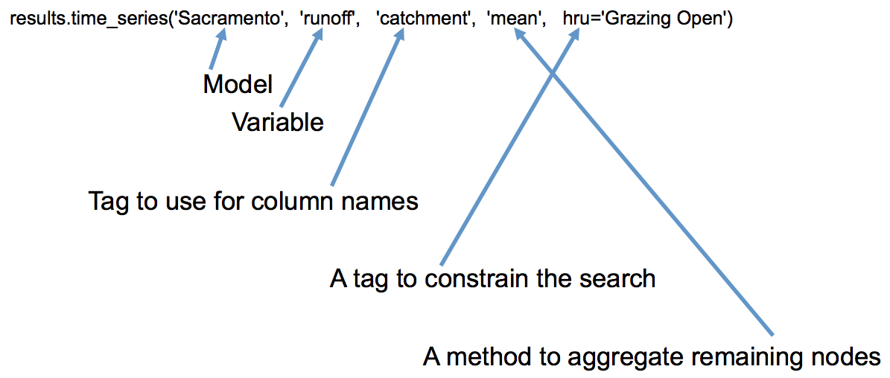
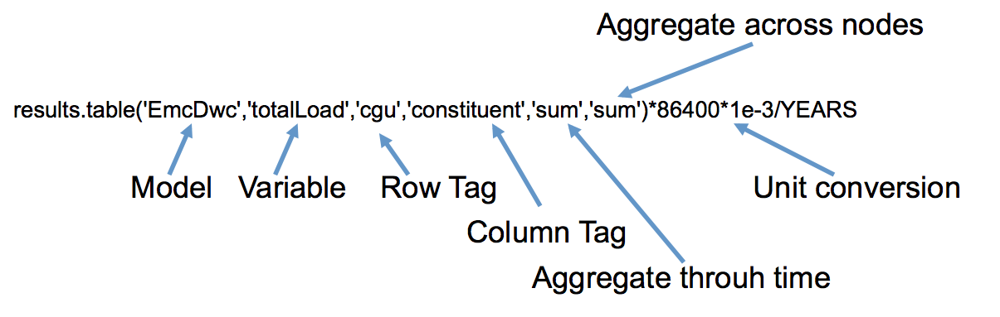

# Reporting model results

When Openwater models are run, a results file is produced. Presently, the results file contains timeseries outputs for each model node within the model graph. 

The results file also contains _input_ timeseries for model nodes that receive inputs from predecessor model nodes. These timeseries are recorded as results as they may be the sum of outputs from multiple predecessor nodes and hence they may not be easily reconstructed.

While the results files, and, indeed the model input files, are HDF5 files, it is recommended to use the Openwater Python package routines for retrieving results. Presently, there are two main ways to retrieve results:

1. Retrieve timeseries from the model, either individually or aggregated across a group of nodes sharing _one_ common tag, and
2. Retrieving tables of results, aggregated from timeseries to a scalar, summarised across a group of nodes sharing _two_ common tags.

In both cases, the functionality is based on using the model node [tags](dimensions.md) to identify individual model nodes or groups of model nodes with common tags.

The following examples illustrate the two main options, along with supporting functionality that can assist in discovering the results of an Openwater model.

## Access the results

After a simulation has run, the results can be accessed using an `OpenwaterResults` object, which is created with a reference to both the model file _and_ the results file:

```python
results = OpenwaterResults('model.h5','results.h5')
```

When you run the model using the `run_model()` method, the system returns an `OpenwaterResults` object for use:

```python
results = model.run_model()
```

The results objects includes methods for retrieving timeseries and tables and for querying the available results.

## Retrieving time series

Timeseries are retrieved as Pandas `DataFrame` objects. Typically multiple timeseries are retrieved as individual columns of the dataframe after which an individual timeseries can be accessed, as required, by selecting the relevant column.



In this case, as in retrieving tables, below, the first two method arguments specify the model and output of interest.

*Note:* It is also possible to retrieve inputs using the same method, so, for example, `rainfall` can be substituted for `runoff` in the above example. If the input is part of the model file, those values will be returned. If however, the model input comes from predecessor nodes in the model graph, those computed inputs will be returned.

With the first parameter specifying a component model (`Sacramento` in this example), there will typically be multiple model graph nodes using the same model, and, hence, multiple independent timeseries for the given variable (`runoff` in the example). From the third parameter onwards, the parameters tell the reporting tools how to reconcile the different graph nodes in the results returned. There are, broadly, three things we can do:

1. Put different nodes in different columns of the `DataFrame`, distinguishing the columns based on a tag. This is done exactly once.
2. Constrain the results search to only match nodes where a particular tag has a specified value. This can be done zero or more times. If this option is not used, then the results will match **all** model graph nodes using the model.
3. A summary statistic to use when combining the results from multiple model graph nodes into a single column.

The third parameter specifies which tag is used to map model graph nodes to individual columns, and, consequently, the name of that column. In this example, the `catchment` tag is used, so the columns of the dataframe will be named for the different values of the `catchment` tag, and the values in a particular column (eg `SC #1`), will be drawn from one or more model graph nodes with that value for the `catchment` tag.

However, although we have specified a tag (`catchment`) for the DataFrame columns, multiple model graph nodes may be matched, meaning that the results from those different nodes need to be aggregated before being stored in the column. For example, in a model with multiple hydrological response units (HRU) within each catchment, a single value of the `catchment` tag will match model graph nodes for each HRU. In this situation, the results from each node must be aggregated with the results from other matching nodes which are to be stored in the same column (in this case, other nodes with the same `catchment` tag). The fourth argument to `time_series` is used to specify a simple statistic by which these multiple individual timeseries are aggregated. The statistic is applied across the various timeseries, at each timestep. In the example, we have specified `mean`, so the resulting column will be a time series of the average runoff, per timestep, from all HRUs in the catchment. 

Additional arguments can be provided in order to _constrain_ the model nodes that are matched, by specifying particular tags of interest. In this case, the `hru` argument specifies that only model nodes where the `hru` tag is equal to `Grazing Open` will be used. Multiple constraints can be specified and it is not necessary to specify any such constraints.

Importantly, the constraint tags may limit the results search sufficiently that there are, at most, one model graph node matched for each column. In this case, the aggregator statistic has no effect.

### Alternate syntax for specifying constraints

In the example, the single constraint tag (`hru`) is a valid Python identifier (ie, it is a string that *could* be used as a variable name or function name). If however, the tag _is not_ a valid Python identifier, it is necessary to use a somewhat more cumbersome syntax:

```python
ts = results.time_series('Sacramento','runoff','catchment','mean',**{'Functional Unit':'Grazing Open'})
```

This is necessary in various situations, such as when the tag type contains a space, starts with a number or is a Python keyword, such as `def`.

The constraint tags are simply Python keyword arguments, so it is quite acceptable to retain a dictionary that can be used for multiple calls:

```python
constraint = {
  'hru': 'Grazing Open',
  'constituent': 'Sediment - Fine'
}

quick_load = results.time_series('EmcDwc','quickLoad','catchment','mean',**constraint)
slow_load = results.time_series('EmcDwc','slowLoad','catchment','mean',**constraint)
```

## Retrieving tables

Retrieving tables of results works similarly to retrieving time series:

You specify:

* the model type of interest,
* the variable (input or output) of interest, and
* (optionally) constrain the selected nodes using keywork arguments

There are, however, some differences:

* In addition to specifying which tag to use for labelling columns, you specify a second tag for labelling rows, and
* You specify two aggregation statistics - one for aggregating across nodes (as for time series) and one for aggregating through time



So, in this example, a given row and column will relate to a particular `cgu` and `constituent`, respectively. If, for example, the model graph has `catchment` nodes, all `catchment` nodes, for a given `cgu` and `constituent` will be matched for a particular cell. Using the aggregation parameters, the `totalLoad` time series from each of these nodes will be summed, before, in this example, the resulting timeseries will be summed, through time, to a scalar.

## Higher level

The above examples illustrate the two core reporting functions in Openwater.

They afford considerable flexibility to identify and subset data, report in different ways and to aggregate data as required. However there are a number of limitations, which, at this point, are overcome by building higher level reporting functions to support a particular model or stye of model.

As illustrated in the table example, above, there will often be the need to perform a unit conversion on the data returned by the reporting functions. In that example, there desire was to see a table of mean annual constituent load, in tons/year, by constituent and land use. This was achieved by summing across catchments and through time, to obtain 'total' loads, then dividing by the number of years in the simulation to create a mean average. However two additional conversions were necessary:

* `*1e-3` to convert the modelled kg to tons, and
* `*86400` to convert the 'per second' model outputs to per day.

This second conversion can be a little confusing, and some additional context is required.

Unstated, in the example, was that the model was running daily. However, the reported fluxes are, by convention, per second fluxes. So, the raw model results, from the EmcDwc model, are kg/s, interpreted as average values over the (daily) timestep.

It is expected that queries, such as these, would be encapsulated in reuseable functions, such as:

```python
def mean_annual_loads(results):
  return results.table('EmcDwc','totalLoad','cgu','catchment','sum','sum')*86400*1e-3/YEARS
```

Another challenge in using the standard reporting tools is the requirement to specify the model and variable (output or input) required. This can be cumbersome in more heterogeneous models where a particular report doesn't always map to the same combination of model and variable.

For example, in a somewhat heterogenous catchment model, the constituent load, for a given constituent and land use (or `cgu`) might be represented by different component model types. In this situation there is _conceptually_ the idea of a constituent load from a CGU for a particular constituent, but the Openwater system only sees the various model nodes in the graph, their tags, and how they are connected. Retrieving, say, a table of mean annual loads, would require invoking the reporting functions multiple times, for different model types, and appropriately combining the results.

This is another situation where custom reporting queries can be built using the basic reporting functionality.
