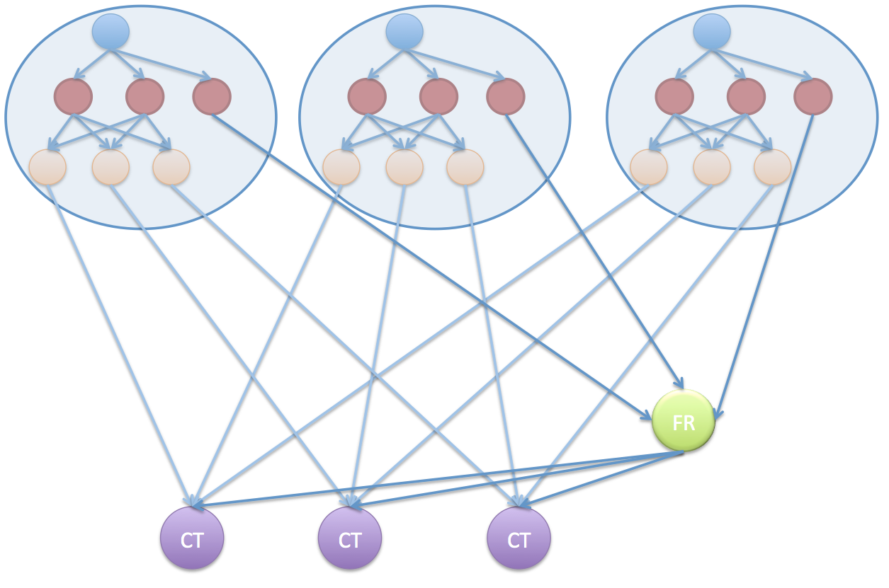

# Openwater Graph Templates

At the core of an Openwater model is a graph of model nodes, with connections between model nodes used to transfer data and to defined the execution order.

The following diagram show such a graph, representing a rainfall runoff model (blue) that is used as an input to several constituent generation models (orange).

**Notes:**
* In reality, the links between nodes are links from specific outputs to specific inputs, such as links from the 'quick flow' or 'base flow' output of the rainfall runoff model.

For simplicity, these specific connections are omitted from the figures that follow.

* Because the rainfall runoff model produces runoff depth, in mm, without reference to the area represented, scaling nodes (red) are used to transform runoff depth to volumetric runoff. Scaling nodes, and other simple transformations, are commonly used in Openwater model graphs and are considered model nodes.

## Larger graphs

In a distributed catchment model, the above diagram might represent a very small portion of the overall graph, which might run to 10'000s or 100'000s of nodes. In many cases, these larger graphs contain many repeated structures, such as having the same structure within each of many subcatchments, where the key difference between subcatchments are different model parameters and input time series.

<figure?>

## Graph Templates

To help manage these large graphs, Openwater uses a system of nested graph templates, that can be composed into larger structures, and ultimately to the whole model graph.

For example, the above graph of rainfall runoff, scaling and constituent generation nodes, might be used as a template for a 'Constituent Generation Unit' (CGU), representing a particular land use within the model:

Multiple copies of the CGU template can then be used, along with other model nodes representing streamflow routing (green) and instream constituent transport (purple), to represent a subcatchment.

## Nested Templates

Graph templates can continue to be nested to form larger model structures.

For example, the subcatchment graph, above, can be defined as a template:

With the subcatchment template, a catchment, such as the following:

can be represented by copying the subcatchment template:

## Connections between templates

When building a model graph from copies of graph templates, it is common to make connections across templates, such as connecting the catchments according to the hydrological topology:

Importantly, the connections between _templates_, is, ultimately, a connection between two nodes (and specific outputs and inputs). So, for example, the connection between catchments would include connection between correspdoning constituent transport model nodes:

Indeed, there can be many connections between templates, mapping between different pairs of nodes:

## Graph Templates in practice

Nested graph templates are a key element of constructing and managing Openwater models.

One approach is to define somewhat flexible templates, which we refer to as 'recipes', which can be used to define a range of structures. An example recipe might be to define a Constituent Generation Unit with a user defined number of constituents, and hence a user defined number of constituent generation model nodes. Similarly, a subcatchment recipe might allow the creation of subcatchments with a user defined set of land uses, each of which would use a copy of the underlying constituent generation unit template.

However graph templates are not the solution in every situations, and, in some cases, a bespoke graph is needed. For example, a reservoir model may need to be represented at certain locations in the catchment, requiring appropriate model nodes to be added to the graph and connections made to upstream and downstream components.

Importantly, this bespoke approach can co-exist with graph templates, with templates used wherever relative homegeneity is required, and bespoke graphs used elsewhere. The template approach is an aid to constructing model graphs, but, at simulation time, the Openwater model engine is only aware of the model graph.

One of the key challenges with a graph based model is sensibly identifying individual nodes, in order to assign model parameters and inputs, to make the right connections between nodes, and to extract and interpret model results. Openwater uses a system of node labelling, called [dimensions](dimensions.md), to support user defined model organisation.

